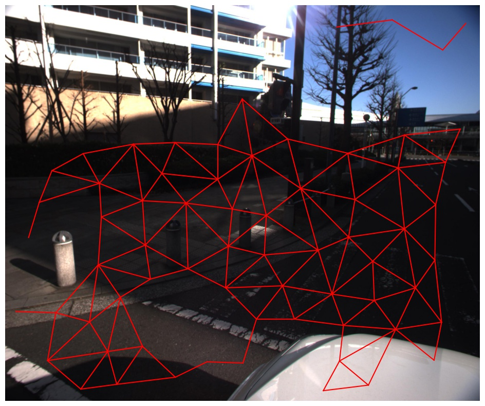

# NTT-intrinsic-dataset

This repository includes the NTT Intrinsic dataset introduced by the following paper: Shogo Sato, Yasuhiro Yao, Taiga Yoshida, Takuhiro Kaneko, Shingo Ando, and Jun Shimamura. "Unsupervised Intrinsic Image Decomposition with LiDAR Intensity". In Proc. of CVPR 2023.
The NTT Intrinsic dataset consists of three components: RGB images, LiDAR intensity mapped to the images, and WHDR annotations.



**Picture:**  *An example of NTT Intrinsic dataset.*

# Dataset Format
We prepared 10,000 samples of png type images with a size of 500 x 600 pixel and LiDAR intensity mapped to the images. In addition,110 samples, which were combined with a total of 12,626 human judgments, were prepared for testing (all.csv). To eliminate bias in the number of annotations, we randomly sampled these annotations so that each annotation size is the same (extracted.csv).

## WHDR annotation format
<pre>
   {
      "FileName": image file name,
      "Ax": x-coordinate of point A,
      "Ay": y-coordinate of point A,
      "Bx": x-coordinate of point B,
      "By": y-coordinate of point B,
      "darker": darker pixels in A and B,
      "weight": Weights reflecting the confidence in the annotation,
    }
</pre>

# Citation
You can cite it as follows:
```bibtex
@inproceedings{Sato2023 Unsupervised,
  title     = {Unsupervised Intrinsic Image Decomposition with LiDAR Intensity},
  author    = {Shogo Sato and 
               Yasuhiro Yao and
               Taiga Yoshida and
               Takuhiro Kaneko and
               Shingo Ando and
               Jun Shimamura},
  booktitle = {CVPR},
  year      = {2023}
}
```

If you have any questions about the paper and repository, feel free to contact Shogo Sato (shg.sato[at] ntt.com) or open an issue!
